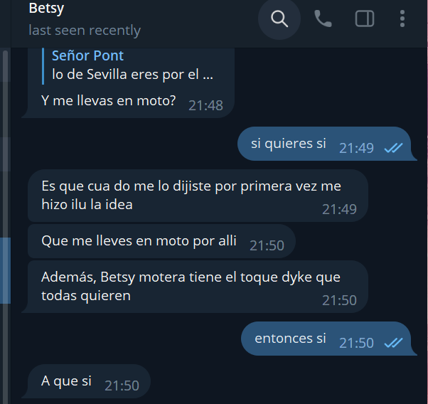
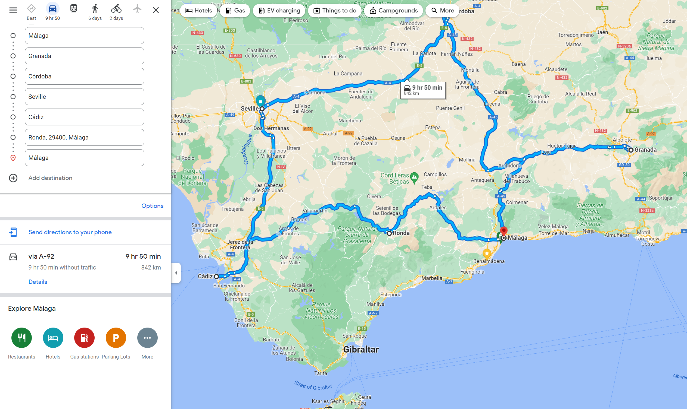

# Plan Hispalis
_No es mas tonto porque no se entrena_

## Meta
- Version 1
- Plan padre: [plan Santiago](Santiago.md)
- Planes dependientes
  - ninguno

### Indice
- [Plan Hispalis](#plan-hispalis)
  - [Meta](#meta)
  - [Introducción](#introducción)
  - [El plan](#el-plan)
  - [La vuelta](#la-vuelta)
  - [Ciudades](#ciudades)
  - [Versiones](#versiones)

## Introducción
El plan Hispalis es un plan de irme con Betsy de moto por Andalucía.

## El plan
Un viaje por Andalucía, una semana, comiendo rico, viendo cosas. Puede estar bonito, y puede darnos convivencia en estos tiempos que corren.

Los vuelos Berlín-Málaga son sorprendentemente baratos. Desde ahí se puede hacer la rutaa Córdoba, Sevilla, Cádiz en bastante poco tiempo cada manga y haciendo noche (o dos noches) en cada sitio

Un plan alternativo es sólamente ver Sevilla. Que se puede hacer perfectamente. Para ello se hará una lista extendida de Sevilla

## La vuelta
El círculo de Málaga, Cordoba, Sevilla, Cádiz es razonable, con mangas de hora y media excepto la última. Granada es un desvío interesante. Ronda puede hacer un viaje de casi tres horas en dos viajes viendo Ronda en lugar de Gibraltar. En total son 10 horas de moto, aproximadamente

| Manga | Distancia | Duración |
|-----|------|-----|
| Malaga - Granada  | 130km | 90 min |
| Málaga - Córdoba  | 163km | 110min |
| Granada - Córdoba | 200km | 120 min |
| Córdoba - Sevilla | 150km | 100 min |
| Sevilla - Cádiz | 120km | 80 min |
| Cádiz - Málaga | 233km | 160 min |
| Cádiz - Ronda | 144km | 100 min |
| Ronda - Málaga | 102km| 90min |

## Ciudades
Planes para cada ciudad con cosas que ver y sitios de comer

### Málaga
- Castillos
### Granada
- Alhambra
### Córdoba
- Mezquita
### Sevilla
- Catedral + Giralda
- Archivo de indias
- Torre del oro
- Cohete > Expo 92 > Triana
- Plaza de España
### Cádiz
- Casco viejo
- Jardín botánico
### Ronda

## Versiones

1. Plan inicial